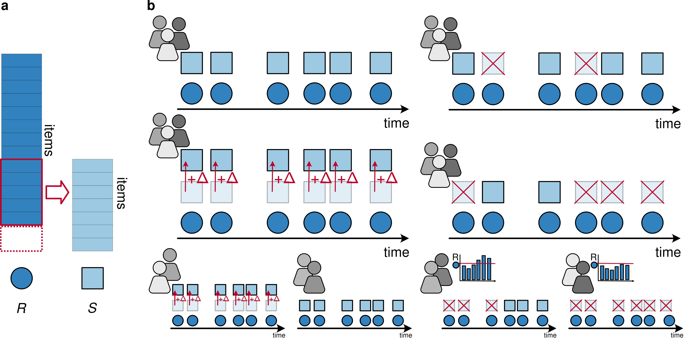

# Domain adaptation for integrating measurement instruments in a longitudinal clinical registry

This repository contains the code for the manuscript 

> Hackenberg, M., Pfaffenlehner, M., Behrens, M., Pechmann, A., Kirschner, J., and Binder, H. (2023) Investigating a domain adaptation approach for integrating different measurement instruments in a longitudinal clinical registry. :globe_with_meridians: [arXiv:2312.00616](https://arxiv.org/abs/2312.00616).

## Introduction

In a longitudinal clinical registry, different measurement instruments might have been used for assessing individuals at different time points. To combine them, we investigate deep learning techniques for obtaining a joint latent representation, to which the items of different measurement instruments are mapped. This corresponds to domain adaptation, an established concept in computer science for image data. 

Using our proposed approach as an example, we evaluate the potential of domain adaptation in a longitudinal cohort setting with a rather small number of time points, motivated by an application with different motor function measurement instruments in a registry of spinal muscular atrophy (SMA) patients. We model trajectories in the latent representation by ordinary differential equations (ODEs), where person-specific ODE parameters are inferred from baseline characteristics. This is based on our previous work on ODEs for latent dynamic modeling of longitudinal data: 

- Hackenberg, M., Pechmann, A., Kreutz, C., Kirschner, J., and Binder, H. (2023) A statistical approach to latent dynamic modeling with differential equations. 2023. :globe_with_meridians: [arXiv:2311.16286](https://arxiv.org/abs/2311.16286); :computer: [LatentDynamics.jl](https://github.com/maren-ha/LatentDynamics.jl/tree/main).
- Hackenberg, M., Harms, P., Pfaffenlehner, M., Pechmann, A., Kirschner, J., Schmidt, T., and Binder, H. (2022). Deep dynamic modeling with just two time points: Can we still allow for individual trajectories?. Biometrical Journal, 64, 1426–1445. :globe_with_meridians: [doi:10.1002/bimj](https://doi.org/10.1002/bimj.202000366); :computer: [DeepDynamicModelingWithJust2TimePoints](https://github.com/maren-ha/DeepDynamicModelingWithJust2TimePoints).

To systematically investigate the effect of differences between measurement instruments, we consider several scenarios based on modified SMA data with artificial discrepancies, including scenarios where a mapping should be feasible in principle and scenarios where no perfect mapping is available. We subsequently evaluate the approach on two measurement instruments from the SMA registry. 

Our results indicate that domain adaptation might be more generally useful in statistical modeling for longitudinal registry data.

## What's in this repository?

- the `src` folder contains the code for loading and preprocessing the data, building, training and evaluating the model, designing and evaluating the synthetic datset modifications and plotting; more specifically:
  - `load_data.jl` contains functions for loading and preprocessing the SMA dataset (which cannot be uploaded publicly for data protection reasons) 
  - `explore_data.jl` contains functions for exploring the data and patterns of measurement instrument availability
  - `modify_data.jl` contains functions for modifying the dataset to create the different synthetic scenarios
  - `model.jl` contains the implementation of our model approach and loss function
  - `ODE_solutions.jl` contains the solution functions for the ODE systems used for modeling the latent trajectories
  - `training.jl` contains the mode training function
  - `training_modifications.jl` contains the code for automatically training the model on the different scenarios with synthetic dataset modifications
  - `eval_modifications.jl` contains the code for evaluating the model on the different scenarios with synthetic dataset modifications
  -  `eval_penalties.jl` contains the code for evaluating the model on the full SMA dataset with different penalty versions in the loss function
  -  `plot_latent.jl` contains the code for plotting the latent trajectories and the ODE solutions
- the `scripts` folder contains the scripts for running the experiments in the paper: 
  - `DatasetInfos.jl` reproduces the statistics about the numbers of patients and visits and patterns of measurement instrument availability and the corresponding visualizations shown in **Section A.3**, **Tables 2 and 3** and **Figures 5 and 6**.
  - `SyntheticModifications.jl` reproduces the results on the synthetic dataset scenarios based on introducing various discrepancies, specifically **Figures 2 and 3 in Section 3.3** and **Tables 4 and 5 in Section A.4**.
  - `PenaltiesNusinersen.jl` reproduces the results from applying the approach on the real SMA dataset of patients treated with Nusinersen using different penalties in the loss function, as shown in **Section 3.4, Figure 4** and **Table 1**. 
  - `PenaltiesOA.jl` reproduces the results from applying the approach on an additional population of SMA patients treated with a different medication, Onasemnogene Abeparvovec (OA), again using different penalties in the loss function, as shown in **Section A.5,Table 6** and **Figure 7**. 
- the `notebooks` folder contains Jupyter notebooks showcasing exemplary analyses from the paper 
- the `results` folder contains the results of the experiments in the paper, which are generated automatically within the scripts